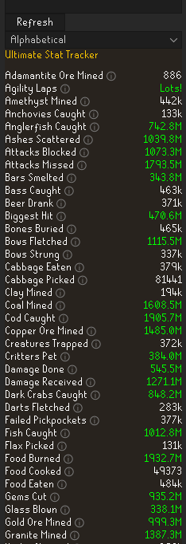
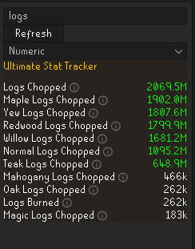
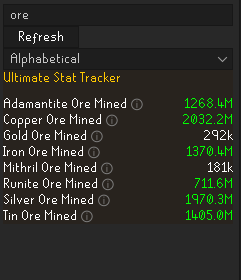
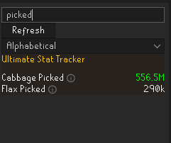
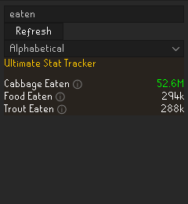
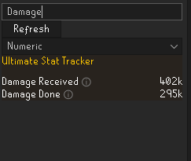

# Ultimate Stat Tracker (RuneLite Plugin)

A comprehensive lifetime stat tracking plugin for RuneLite that records various account activity across your entire accounts lifetime.
The ultimate "number go up" plugin as requested by the 2007Scape subreddit.

## What It Tracks

The plugin captures a broad range of gameplay data. Here's a high-level overview:

### General Activity

* Items examined, dropped, and vials smashed
* GP spent and gained in shops
* Tiles walked and ran

### Gathering & Resource Collection

* Fishing: Tracks all major fish types (from shrimp to dark crabs) caught
* Mining: Tracks ores, pay-dirt, essence etc mined.
* Woodcutting: Tracks all log tiers (normal to redwood) chopped. Sailing trees to be added soon.  
* Misc gathering like flax and cabbage picked (for the nostalgia). 

### Farming

* Weeds raked
* Seeds planted

### Prayer

* Bones buried
* Ashes scattered

### Firemaking

* Logs burned

### Food & Consumables

* Food eaten and cooked
* Food burned
* Potion sips consumed
* HP regeneration
* Beer and specific foods (like cabbage, trout)
  

### Combat

* Total damage dealt and received
* Biggest hitsplat
* Attacks blocked and missed

### Other Skilling Activities

* Agility: Rooftop and regular laps
* Thieving: Pickpockets, failures, stalls
* Herblore: Potions made, herbs cleaned
* Runecraft: Runes crafted
* Crafting: Gems cut, glass blown
* Fletching: Bows, darts, stringing
* Hunter: Creatures trapped, implings caught
* Smithing: Bars smelted, items made
* Firemaking: Logs burned

### Miscellaneous

* Critters pet
* Other stats im probably forgetting

---

## Features

* Lifetime Tracking – Automatically records a plethora of stats for your account over time
* Sortable Interface – Sort stats alphabetically or numerically
* Start Date Tracking – See exactly when each stat began tracking
* Reset Functionality – Reset individual stats whenever you want
* Wide Coverage – Tracks a large variety of in-game actions across multiple skills and activities

---

## Usage

1. Install the plugin
2. Play normally — stats begin tracking automatically
3. Use the panel to:

    * Search for stats
    * Sort them (A–Z or by value)
    * View tracking start dates
    * Reset individual stats
    * The panel will update when opened, the refresh button is hit, the filtering is changed, or the search term is updated.

---

## Future Ideas

* Export stats to csv
* Session-based tracking/"soft reset" capability
* Milestone notifications
* Many more stats such as individual seeds planted, individual npcs thieved, etc.

---

## Contributing

* Contributions are welcome! If you have ideas for new stats to track or improvements to the plugin, feel free to submit a pull request or open an issue.

---

## Bugs
* Due to the sheer amount of stats tracked, bugs are bound to pop up. Please feel free to report any bugs and I will do my best to fix them as soon as possible :)